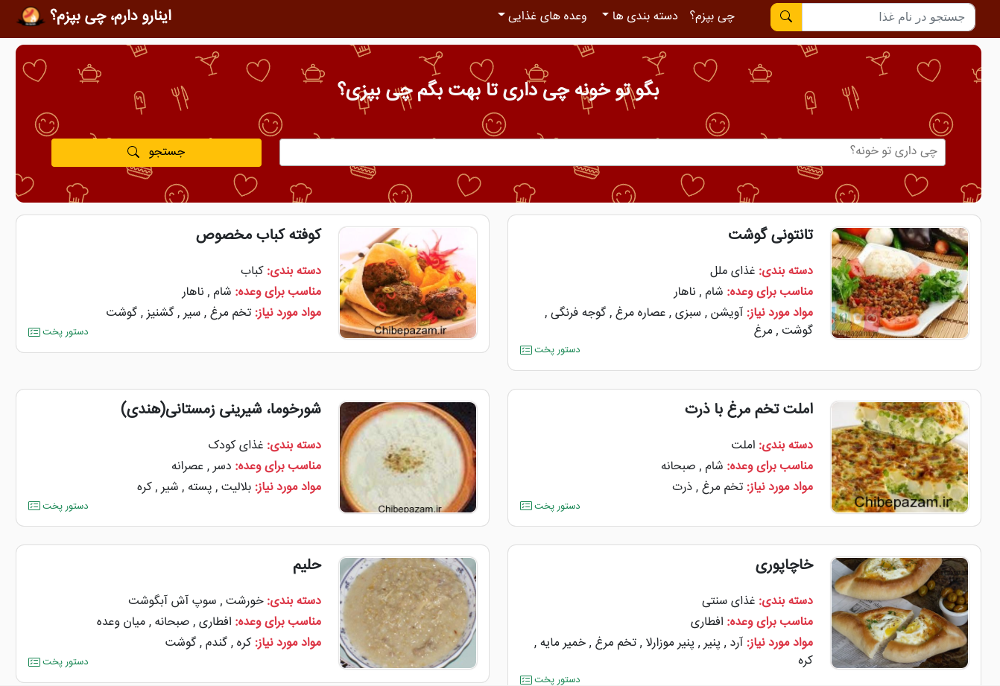

# Inarodaram - Food Suggestion System

Web application with Laravel that suggests the food that you can cook.

This project uses Bootstrap 5 for the front end.

you can visit the demo here:
[Inarodaram.ir](https://inarodaram.ir)




## Installation

```
composer install

npm install
```

if  you are using cpanel:
```
cp .htaccess.example .htaccess
```

Setup your database information in .env file

```
php artisan migrate
```

## Production Setup

### Queue
you must add a queue to the supervisor for notifications

https://laravel.com/docs/8.x/queues#supervisor-configuration

### Redis
You need to install that in production for a better experience with the cache and add details in the .env file.
if you don't have Redis, you can use 'file' for CACHE_DRIVER

## Development

### composer.locks
please don't commit your local version to git, (it breaks composer if you use a higher version on your local machine)

### env Variables
please don't use the env variable. because we use the artisan optimize command it doesn't get value from .env file.

you must put these env variables in the app/config directory

### Versioning
Don't commit anything in git without a merge request.

### Front End
if you need to add a custom CSS or custom JS code you must add it to the style or script section on the blade page.

if you need to add a new style that must run on every page you can add it into _custom.scss file in the resources directory.

if you need to add a new script that must run on every page you can add it to the custom.js file in the resources directory.

after that, you must run:

```
npm run prod
```

#### Don't commit any css or js library in the public folder.
if you need an extra library on your page that cannot be used by a CDN, you can move it into the plugin's directory in the public folder.
